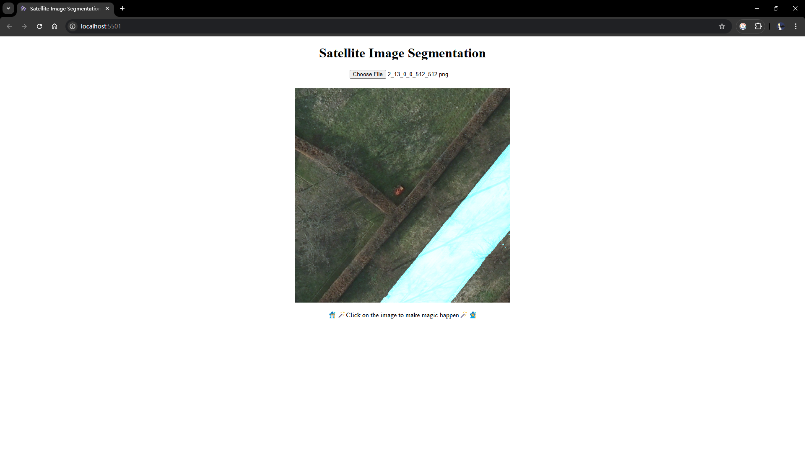
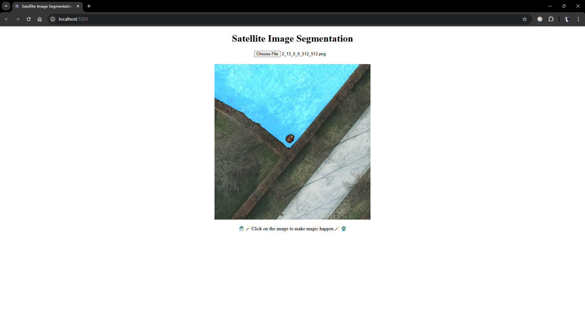
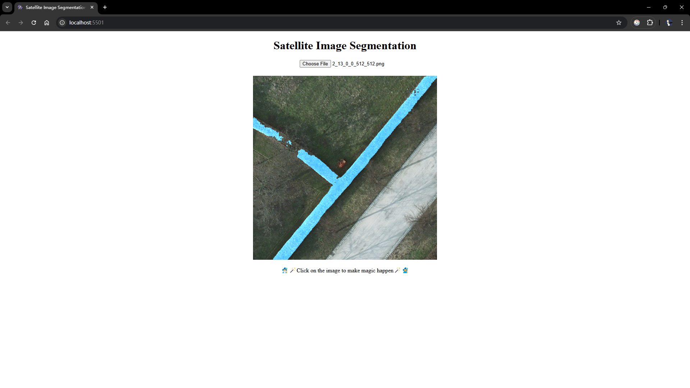

# SAM-Flask-Web

这是一个基于 [Segment-Anything](https://github.com/facebookresearch/segment-anything) 的前后端分离的图像分割项目。其后端由 Python + SAM + Flask 构建，前端由 HTML + CSS + JavaScript 构建。

## 安装和启动

- git clone

  ```shell
  git clone git@github.com:whut-zhangwx/SAM-Flask-Web.git
  cd SAM-Flask-Web
  ```

- 创建 Python 环境

  ```shell
  conda create --name samenv python=3.8
  codna activate samenv
  pip install numpy cv2 flask flask_cors segment_anything
  ```

- 下载模型权重

  ```shell
  # (Huge)  vit_h (default):
  https://dl.fbaipublicfiles.com/segment_anything/sam_vit_h_4b8939.pth
  # (Large) vit_l:
  https://dl.fbaipublicfiles.com/segment_anything/sam_vit_l_0b3195.pth
  # (Base)  vit_b:
  https://dl.fbaipublicfiles.com/segment_anything/sam_vit_b_01ec64.pth
  ```

- 启动后端服务

  ```shell
  cd backend
  python flask_server_pytorch.py
  # default address-port: http://0.0.0.0:5500/
  ```

- 启动前端服务

  ```shell
  cd frontend
  python -m http.server --bind ADDRESS PORT
  # default address-port: http://0.0.0.0:5501/
  ```

## 示例








